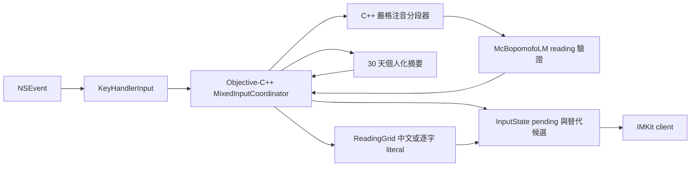

# 中英文自動混合輸入功能規格

- 文件狀態：第一版規格已定案，階段 0、1 與 2 已實作
- 最後更新：2026-09-06T03:08:26+08:00
- 第一版範圍：McBopomofo 主輸入模式、標準注音鍵盤、一般注音與可列印 ASCII
- 建議實作語言：C++，直接整合既有 `BopomofoReadingBuffer`、`McBopomofoLM` 與 `ReadingGrid`

## 摘要

本功能讓使用者不切換中英文輸入模式，就能從同一串實體按鍵輸出中文、英文或中英混合內容。例如標準注音鍵盤輸入 `ji3vu04y94callsu3`，預期輸出 `我現在call你`。

依已確認的第一版規則，不需要英文詞頻資料：

1. `3`、`4`、`6`、`7` 是有聲調注音的終止鍵。
2. 空白只用來完成一聲注音，不用來選字。
3. 一段按鍵必須符合嚴格注音 component 順序，而且其 reading 在中文語言模型中有詞彙，才判為中文。
4. 無法組成中文 reading／詞彙的可列印 ASCII 保持原文，因此英文單字、程式碼、email、URL 等不需要先存在英文詞典。
5. Shift + Letter 直接輸出對應大寫字母；Caps Lock 開啟時進入明確英文輸入。

這個規則比原先的「中英文雙語評分模型」簡單，主要工作變成一個確定性的增量分段器。由於分段器必須頻繁使用本專案現成的 C++ 注音配置與中文語言模型，第一版直接以 C++ 實作比新增 Rust static library、C ABI、Cargo 與 universal archive 更合適。Rust 可在日後需要獨立模型或更複雜解碼器時再評估。

功能與本機個人化學習各有一個設定開關，兩者預設關閉。個人化只保存最近 30 天的分類選擇摘要，不保存完整句子。

## 實作狀態

| 範圍 | 狀態 | 備註 |
|---|---|---|
| strict parser 與混合分段器 | 已實作 | C++ 純函式，已有核心範例與 edge case 測試。 |
| literal language model | 已實作 | 每個 ASCII 字元使用 session-scoped opaque reading。 |
| `KeyHandler` 基本路由與 `MixedInputting` | 已實作，待完整 Xcode 驗證 | 功能開關預設關閉，只套用主模式與 Standard layout。 |
| 設定 UI 與三語在地化 | 已實作 | 主功能與個人化各有開關，皆預設關閉。 |
| 混合替代候選 | 已實作，待 IMKit 實機驗證 | pending 含中文解讀時，向下鍵顯示中文與原始 ASCII；空白不選字。 |
| 30 天個人化模型 | 已實作 | 本機加鹽 SHA-256 簽章與最近三次明確選擇；保留舊版日桶資料相容性及容量淘汰。 |
| macOS 10.15 | 專案設定已完成，待 runtime 驗證 | Xcode deployment target 已設為 10.15。 |
| 命令列驗收程式 | 已編譯 | Apple Silicon Mach-O，內含本次分段器與語言模型，可在無 Xcode 時驗收核心輸出。 |

## 規格修訂紀錄

- `R1`（2026-08-18T03:53:27+08:00）：KeyHandler 第一版使用 shadow raw token 產生預覽，遇到硬邊界才將中文 reading 與 literal 寫入 grid。這與「先插入 provisional node、必要時回復」具有相同外顯結果，但在 `a3@example.com` 回溯案例中不必刪除已建立的 grid node，降低游標與候選狀態失配風險。
- `R2`（2026-08-18T03:53:27+08:00）：連續數字必須達三碼才單獨構成 protected ASCII 證據。兩碼數字可能是合法注音 component 加聲調，例如 `vu04`，不可直接把整段判成 ASCII；`sha256` 仍會受保護。
- `R3`（2026-08-18T04:02:58+08:00）：個人化儲存改由 Swift／Foundation 實作，透過 Objective-C runtime 供 `KeyHandler.mm` 呼叫。分類演算法仍留在 C++，儲存則直接使用專案現有的 `Preferences` 與 `UserDefaults`，不需要新增 C ABI 或第三方相依。

## 混合邊界與個人學習修正

最後更新：2026-09-06T03:08:26+08:00

回查 `e9cf239`、`bd5442c` 與 `6f2d9fd` 後，確認延後空白的還原條件
只接受後續的純英文解讀。後續單詞緊接有聲調中文時，整段已包含中文，
因此第一個單詞被誤判的尾碼及空白不會還原。HEAD 實測可重現
`apple doctorsu3` → `app高doctor你`，以及 `hello worldsu3cl3` →
`hellㄟworld你好`。新的回歸案例同時檢查組字預覽與 Enter 後實際送出的文字。

修正後，後續段落的英文前綴也能提供還原前一個單詞的依據。連續空格會
保留英文間隔；中文一聲與使用者明確學到的中文偏好仍受到保留。
含注音數字或標點鍵的中文後綴，例如 `machine learningg0 ` 的 `g0 `，
也能在英文單詞之後完成一聲。

候選修正改為驗證及替換整個歧義 token 的 reading 範圍，因此選擇
`apple` 時會學到 `apple`，不再只學到 `le`。自動採用英文後仍提供中文
候選；轉回中文時，以轉換後的 reading 游標座標選字，避免舊的英文索引
超出 grid 範圍。取消候選不改變學習結果，刪除失效範圍後不能套用舊修正。

個人化只採用明確候選選擇，同一 token 在 candidate、space、enter、
punctuation 邊界共用記錄。最近三次選擇一致時採用該偏好；選擇不一致時
回到中立，三次反向選擇即可改變既有習慣。既有 V1 日桶資料仍可讀取，
新記錄保留最近三次選擇及三十天期限。儲存維持加鹽 SHA-256 簽章，
最多保留 2,000 個 token，寫入新選擇時依日期淘汰較舊記錄，避免達到
容量上限後停止學習。無效歷史計數不參與分類。

驗證方式見 [LocalBuild/README.md](LocalBuild/README.md)。CRAP 以本次
新增及修改函式為範圍，使用 Lizard CC 與 LLVM executable line coverage；
無覆蓋率的函式以 0% 計算保守上界，不代表整個既有專案都符合門檻。
這仍是以注音與輸入情境判斷的功能；完全沒有區別訊號的全小寫 token
可能需要透過候選選擇教導偏好。

## 已確認的產品決策

| 原編號 | 決策 |
|---|---|
| 1 | 第一版只支援 McBopomofo 主輸入模式的基本功能；不支援 Plain Bopomofo。 |
| 2 | 功能可在偏好設定中啟用，預設關閉。 |
| 3 | 第一版不使用英文詞頻資料，以「能否形成合法且有詞彙的中文 reading」為主要分類依據。 |
| 4 | 英文範圍包含一般單字、程式碼、email、URL、路徑等可列印 ASCII；不處理帶音調字母、組合附加符號等非 ASCII 文字。 |
| 5 | 組不成中文詞彙就保持原始 ASCII；資訊尚不足時保留 pending，等待聲調或邊界。 |
| 6 | 一聲注音一律由空白完成。 |
| 7 | 混合輸入模式不使用空白選字；空白只能完成一聲或成為英文後的實際空白。 |
| 8 | Shift + Letter 是大寫英文；Caps Lock 是明確英文輸入。 |
| 9 | 第一版加入可選的本機個人化，資料只保留 30 天；統計方法採適合二元分類的 Beta-Bernoulli，而非常態分佈。 |
| 10 | 第一版不擴充 Ctrl+Enter、Ruby、拼音、點字等衍生輸出，只處理一般注音與英文組字。 |
| 11 | 不允許跨中文與英文 literal 範圍建立使用者詞彙。 |
| 12 | 最低執行環境以 macOS 10.15 為準；實作前需同步修正目前 Xcode 專案中 12.0 的設定。 |
| 13 | 允許使用額外 toolchain，但經開源方案比較後，第一版建議直接使用既有 C++。 |
| 14 | 誤判率、延遲及穩定性先採本文件的建議門檻。 |

## 為什麼原先考慮英文詞頻資料

「組不成注音就當英文」確實可以涵蓋大多數情形，也是第一版應採用的基礎規則。原先考慮英文詞頻，不是因為所有英文都必須查詞典，而是有些按鍵同時存在兩種合法解讀：

- `ru4` 在標準注音中是合法的 `ㄐㄧˋ`，也可能是使用者要輸入的型號或程式識別字 `ru4`。
- `ji` 加空白可形成一聲 `ㄨㄛ` 並在中文詞庫中找到字，也可能是英文縮寫、人名或程式 token。
- `callsu3` 可切成 `call` + `su3`，但也可能找到其他較短的中文後綴；只檢查整串是否合法不足以決定切點。
- 英文版本號末尾的 `3/4/6/7` 可能被誤認成聲調，中文按鍵也可能剛好長得像英文單字。

英文詞頻可在「中文與英文都合法」時提供第二項證據，但它也會漏掉人名、程式碼、公司內部縮寫及新詞。依目前決策，第一版不引入英文詞頻，而採以下明確優先序：

1. Shift／Caps Lock 或已進入結構化 ASCII token 時，英文優先。
2. 完整按鍵符合嚴格注音規則，且中文 LM 有 reading 時，中文優先。
3. 無中文 reading 時，原始 ASCII 優先。
4. 兩者都合理時先等待邊界；到邊界仍歧義則中文優先，使用者可從替代候選改成英文。
5. 最近 30 天的明確人工選擇可覆蓋第 4 項，但不能把語法上不合法的 reading 變成中文。

因此不使用英文詞頻的代價是：少數「本身恰好是合法注音鍵序」的全小寫英文或程式碼，第一次可能被判成中文。這是無額外英文知識時不可完全消除的資訊不足，而不是實作錯誤；個人化可改善重複案例。

## 何時需要等待更多輸入

下列情況不應過早寫入 ReadingGrid：

1. 目前按鍵仍是合法注音前綴，但尚未收到 `3/4/6/7` 或空白，例如 `s`、`su`。
2. 已出現像英文的前綴，但尾端可能是下一個中文音節，例如 `calls`、`callsu`；收到 `3` 後才可確定 `call` + `su3`。
3. 單一末尾數字可能是聲調，也可能是程式碼／版本號的一部分，例如 `ru4`；可暫留到下一個空白、標點、Enter 或 ASCII 結構字元。
4. 尚未完成的結構 token，例如 `http`、`https:`、`name@`，後續的 `/`、`@` 或 `.` 會使整段確定為 ASCII。
5. 使用者在 pending 範圍內刪除或移動游標後，原本的切點可能失效，必須重新解析該局部範圍。

pending buffer 建議上限為 64 bytes。超過上限仍無法判定時，應在不遺失文字的前提下，把最早且不可能成為中文的 ASCII 前綴固定為 literal。

## 現有架構觀察

1. `InputMethodController.swift` 把 `NSEvent` 轉成 `KeyHandlerInput`，由 `KeyHandler` 產生不可變 `InputState`。
2. `KeyHandler.mm` 目前優先把合法按鍵送入 `BopomofoReadingBuffer`，遇到聲調、空白或 Enter 才將 reading 放入 `ReadingGrid`。
3. `ReadingGrid` 要求每個 reading 至少有一個 unigram，因此任意 ASCII 不能直接插入。
4. `buildInputtingState` 以 reading span 與 UTF-16 長度計算游標。英文若以整個單字作為單一 reading，Backspace 會一次刪掉整個單字。
5. UserOverrideModel、聯想詞、使用者詞彙與注音標音都假設 reading 是中文；literal 節點必須排除。
6. 專案核心已是 C++／Objective-C++，且 `Mandarin` 類別已完整實作標準注音鍵位，直接以 C++ 重用最少風險。

## 開源相近方案調查與語言選擇

### 調查結果

- [Fcitx Autoeng](https://fcitx-im.org/wiki/Special%3AMyLanguage/Autoeng) 以 C 實作；大寫字母或 `www.` 等前綴清單會觸發暫時英文模式。它證明「明確訊號加前綴規則」是成熟做法，但不會自動切開無空白的注音與任意 ASCII。
- [Rime recognizer](https://github.com/rime/librime/blob/master/src/rime/gear/recognizer.cc) 以 C++ 對 active input 套用可設定的正規表示式，可辨識 URL 等特殊片段；[Rime ASCII composer](https://github.com/rime/librime/blob/master/src/rime/gear/ascii_composer.cc) 則處理 Shift、Caps Lock 與 inline ASCII。它的責任分層很值得參考，但 ASCII 模式仍主要靠明確切換或 pattern。
- [IBus Typing Booster](https://github.com/mike-fabian/ibus-typing-booster) 以 Python 實作，可同時使用多種語言、利用 Hunspell 字典並從使用者輸入學習。它是候選與補全系統，範圍遠大於本功能，也不是針對標準注音鍵位的確定性切分。
- [librime](https://github.com/rime/librime) 本身是跨平台 C++ 輸入法引擎，證明 C++ 足以處理可設定的分段與多翻譯器架構；但整套引入本專案會增加遠超需求的相依與授權審查範圍。

在已檢查的開源實作中，沒有找到可直接移植、且完全符合「標準注音聲調終止 + 中文 LM 驗證 + 任意 ASCII fallback + 無空白中英切分」的演算法。這是依上述原始碼與專案文件做出的推論。

### 語言比較

| 選項 | 優點 | 成本／限制 | 第一版建議 |
|---|---|---|---|
| C++ | 直接存取既有注音 parser、LM、grid；無新 ABI；沿用 CMake／Xcode／GoogleTest | 需嚴格管理 literal registry 與邊界 | 採用 |
| Rust staticlib + C ABI | 記憶體安全、fuzz 工具成熟、分類器可獨立封裝 | 需 Cargo、雙架構 archive、C ABI、panic 與 buffer ownership、防止 deployment target 不一致 | 暫不採用 |
| Swift | 設定 UI 與 Foundation 儲存方便 | 無法直接使用 C++ 類別；仍須經 Objective-C++ bridge；演算法會跨層 | 只用於設定 UI |
| Python | 原型快，現成 NLP 資源多 | 不適合內嵌 macOS IMK runtime，部署與延遲成本高 | 只可做離線 corpus 工具 |
| 完整引入 librime／IBus | 已有大型多語架構 | 改變現有架構、依賴與授權面過大 | 不採用 |

結論：第一版以 C++ 實作確定性分段器。若日後加入大型統計模型，再將已穩定的純資料介面抽成 C ABI 並考慮 Rust，不需要現在預先承擔橋接成本。

## 實作方法

### 整體資料流



### 1. 嚴格注音候選規則

第一版只處理 Standard layout。與現有容許覆寫 component 的即時 reading buffer 不同，混合分段用的候選驗證必須是嚴格模式：

- 一個音節的順序為聲母、介音、韻母、聲調。
- 每一類 component 最多出現一次；不能用後一鍵默默覆寫前一鍵來讓英文看似合法注音。
- `3/4/6/7` 只能出現在音節最後。
- 空白不放入 reading，只把無顯式聲調的合法音節定為一聲。
- 完整 reading 還必須通過 `McBopomofoLM::hasUnigrams()`，否則原始按鍵是 ASCII。

這個嚴格 parser 只用於判斷中英文邊界，不取代現有 `BopomofoReadingBuffer` 的一般中文行為。

### 2. 增量分段流程

`MixedInputCoordinator` 在現行 `Handle BPMF Keys` 前攔截符合範圍的按鍵：

1. 未加修飾鍵的小寫字母與數字先放入 pending raw buffer。
2. 每次追加後枚舉「整段中文」及「ASCII 前綴 + 最長合法中文後綴」。
3. 有聲調終止鍵時，選擇最長、符合嚴格順序且 LM 有詞彙的中文後綴；前方無法形成中文的部分成為 literal。
4. 空白到達時，只有「整個 pending 恰為一個合法一聲 reading」才消耗空白並插入中文；否則 pending 以 ASCII 輸出，空白本身也保留。
5. Enter 不代表一聲；尚未完成的 pending 以 ASCII 原文 flush，再執行一般提交。
6. 已出現 `@`、`://`、路徑 separator、底線、加號、井號、等號、連續三碼以上數字等結構證據時，整個 token 進入 protected ASCII，直到空白或明確中文新起點。
7. 若同時存在合理中文與 ASCII，先保持 pending；硬邊界仍無法消歧時使用「明確英文、個人化、中文、ASCII」的優先序。

coordinator 必須替目前尚未遇到硬邊界的 token 保存 raw provenance。第一版採 shadow plan：聲調完成的中文先由 `MixedInputting` 顯示預覽，但不立刻寫入 grid；如果稍後出現 `@`、`://` 等強 ASCII 證據，就直接用同一份 raw token 重新分段。空白、Enter、游標移動或叫出候選時，才把當前 plan 固定成中文 reading 與逐字 literal。這是正確處理 `a3@example.com` 等案例的必要條件。

`callsu3` 在 `3` 到達後，嚴格 parser 找到最長中文後綴 `su3`，前綴 `call` 因重複 component／順序不合法而保留 ASCII，得到 `call你`。

### 3. ASCII literal 與 ReadingGrid

新增包裝現有 `McBopomofoLM` 的 decorator。一般 reading 完整委派給既有 LM；session 內註冊的 opaque literal key 回傳單一字元 unigram。

- 英文與程式 token 以一個可見 ASCII 字元對應一個 literal reading。
- Backspace、Delete 與左右鍵因此仍以一個字元為單位。
- opaque key 不直接包含原始文字，避免 `-` separator、保留名稱及超長 key 衝突。
- literal 不送入 UserOverrideModel、不參加聯想詞、不做注音標音，也不能跨語言寫入使用者詞彙。
- 第一版遇到含 literal 的組字時，不啟動 Ctrl+Enter 衍生輸出；一般 Enter 只提交畫面文字。

### 4. Shift、Caps Lock、標點與空白

- Shift + Letter 直接形成對應大寫 literal；若已有 pending，先保留於同一 marked text，不強制提交整段中文。
- Caps Lock 開啟後的可列印 ASCII 視為 protected ASCII；關閉後重新開始自動判斷。
- Command、Option、Control 快捷鍵與功能鍵遵守既有 pass-through 規則。
- pending 已是 protected／確定 ASCII 時，ASCII 標點保持半形原文。
- pending 為空時，標點仍走現有全形／半形中文標點設定。
- 混合模式不以空白開候選窗。空白只完成合法一聲，否則提交實際 ASCII 空白。
- 向下鍵可開啟現有位置的中文候選；若 pending 有中英文歧義，也可在同一候選窗顯示「中文解讀」與「原始 ASCII」。空白不可選候選。

### 5. InputState

新增：

- `InputState.MixedInputting`：繼承 `Inputting`，帶有 pending raw range、目前解讀及歧義標記。
- `InputState.ChoosingMixedInputCandidate`：階段 2 新增，提供中文與原始 ASCII 替代方案；選擇後建立新 state，不修改舊 state。

組字 UI 仍只由 state 推導，不把判斷旗標散落在 controller。

### 6. 30 天本機個人化

「中文或英文」是二元分類，不適合直接假設為常態分佈。常態分佈適合連續量測值；此處每次觀察只有 English／Chinese。建議使用 Beta-Bernoulli：Beta 分佈表示某個按鍵簽章被選成英文的機率，Bernoulli 表示每次實際選擇。

資料設計：

- key：本機加鹽雜湊後的 `raw token + 左右邊界類型`，不保存完整句子。
- value：最近 30 個 UTC 日桶中的 `english_count`、`chinese_count`。
- 先驗：`Beta(1, 1)`。
- 後驗平均：`P(English) = (english_count + 1) / (english_count + chinese_count + 2)`。
- 至少累積 3 次明確人工選擇才影響自動結果。
- `P(English) >= 0.8` 時歧義案例偏向英文；`<= 0.2` 時偏向中文；中間仍採基礎規則。
- 只學習使用者在混合候選窗的明確選擇，不把分類器自己的輸出再當真值，避免自我強化錯誤。
- 每次載入及每日第一次寫入時刪除超過 30 天的日桶；關閉學習後停止讀寫偏好分數，既有資料自然到期。
- UI 只提供「啟用個人化學習」開關，預設關閉；不增加統計圖表或管理頁。

若一定要使用常態近似，至少要有足夠樣本量才合理；第一版小樣本且需要機率界線，Beta-Bernoulli 更直接。

### 7. macOS 10.15

- 將主 target、測試 target 與相關 local package 的 deployment target 稽核並統一到 10.15。
- 不使用高於 10.15 才提供的 Foundation／SwiftUI API，或加上 availability guard。
- 新 C++ 分段器不增加 runtime library；沿用現有 C++ standard 與編譯設定。
- CI 至少保留編譯時 deployment target 10.15；實機／VM smoke test 的可用環境另行安排。

## 建議實作階段

第一版採垂直切片交付。每個切片必須同時包含產品程式碼、測試與必要文件，且功能開關關閉時不得改變既有輸入行為。

### 階段 0：規則原型

- 在 C++ 建立 strict Standard-layout parser 與純函式 segmenter。
- 用人工 fixture 驗證中文、ASCII、最長中文後綴及等待狀態。
- 不接入 IMKit、不寫個人資料。

### 階段 1：基本混合輸入

- 新增設定開關、coordinator、literal LM、MixedInputting state。
- 支援聲調、空白一聲、Enter、Shift、Caps Lock、逐字刪除與游標。
- 支援一般 ASCII、程式碼、email、URL 的 protected token。
- 主模式及 Standard layout 以外一律維持現行行為。

### 階段 2：候選修正與個人化

- 向下鍵開啟中英文替代候選，空白不選字。
- 實作 30 日桶、Beta-Bernoulli 與設定開關。
- 加入資料到期、時鐘異常、停用與重新啟用測試。

### Trunk-based Git 管理流程

- `master` 是唯一長期存在的 trunk；不建立長期 `develop` 或版本整合分支。
- 本次使用短生命週期分支 `feat/mixed-input-v1`，隨時保持可 rebase 到 `master`，完成後以小型 pull request 合併回 trunk。
- 提交依可獨立審查的垂直切片拆分，並使用 Conventional Commits：先 `docs(mixed-input)` 定案規格，再依序使用 `feat(engine)`、`feat(input)`、`feat(preferences)` 與 `test(mixed-input)`。
- 每個提交都必須可編譯；演算法與行為變更不得只在最後一個提交才補測試。
- 功能以預設關閉的 preference 作為 release toggle。尚未完成的切片可以合併到 trunk，但不得讓一般使用者進入未完成路徑。
- 合併前更新到最新 `master` 並執行受影響測試；不使用長期 feature freeze，也不在分支內混入無關重構。

## 預計異動檔案

| 類型 | 檔案 | 用途 |
|---|---|---|
| 新增 | `Source/Engine/MixedInputSegmenter.h/.cpp` | strict parser、pending 判定、最長中文後綴與 protected ASCII |
| 新增 | `Source/Engine/MixedInputSegmenterTest.cpp` | 純 C++ 分段與 property-style 測試 |
| 新增 | `Source/Engine/MixedInputLanguageModel.h/.cpp` | LM decorator 與 literal registry |
| 新增 | `Source/Engine/MixedInputLanguageModelTest.cpp` | literal、委派、刪除與 registry 測試 |
| 新增 | `Source/MixedInput/MixedInputCoordinator.h/.mm` | KeyHandler 協調、raw provenance、暫定 node 回復與狀態套用 |
| 新增 | `Source/MixedInput/MixedInputUserModel.h/.mm` | 30 日桶、雜湊、讀寫及 Beta-Bernoulli 分數 |
| 新增 | `McBopomofoTests/MixedInputKeyHandlerTests.swift` | 逐鍵 callback、marked text 與提交整合測試 |
| 修改 | `Source/KeyHandler.h/.mm` | 混合按鍵路由、clear／flush／force commit |
| 修改 | `Source/InputState.swift` | MixedInputting 與混合候選狀態 |
| 修改 | `Source/InputMethodController.swift`、候選 delegate | 顯示與選擇新狀態 |
| 修改 | `Source/Preferences.swift` | 主功能與個人化開關、預設值、報告輸出 |
| 修改 | `Source/PreferencesUI/PreferencesModel.swift`、`PreferencesView.swift` | 兩個設定開關 |
| 修改 | `Source/Base.lproj/Localizable.strings`、`en.lproj`、`zh-Hant.lproj` | 新 UI 本地化 |
| 修改 | `McBopomofoTests/PreferencesTests.swift` | 預設值與 snapshot／restore |
| 修改 | `Source/Engine/CMakeLists.txt`、`Source/CMakeLists.txt` | 新 C++ source 與 GoogleTest |
| 修改 | `McBopomofo.xcodeproj/project.pbxproj` | source、test 與 macOS 10.15 deployment target |
| 修改 | `.github/workflows/continuous-integration-workflow-xcode-latest.yml` | 新測試與 10.15 deployment target 編譯檢查 |

第一版不新增 Cargo、Rust archive、英文詞頻 resource 或第三方輸入法引擎。

## 測試用例設計

### A. C++ 分段器單元測試

| 編號 | 輸入／條件 | 預期結果 |
|---|---|---|
| S01 | `su3` | strict reading `ㄋㄧˇ`，LM 有詞時回中文 |
| S02 | `call` + Enter | strict 注音順序不成立，回 literal `call` |
| S03 | `callsu3` | 最長合法中文後綴為 `su3`，結果 `call` + 中文 |
| S04 | `ji` + Space | 空白完成一聲；LM 有詞時為中文且不輸出空白 |
| S05 | `ji` + Enter | Enter 不完成一聲，回 literal `ji` |
| S06 | `qzxm` | 無合法中文 reading，完整保留 ASCII |
| S07 | `name@example.com` | `@` 後 protected ASCII，所有標點保持原文 |
| S08 | `https://example.com/a3` | URL 全段 protected，`3` 不當聲調 |
| S09 | `x86_64`、`sha256`、`C++`、`foo_bar` | 結構 token 保持 ASCII |
| S10 | 相同 component 重複或順序反轉 | strict parser 判為非中文，不沿用 reading buffer 的覆寫結果 |
| S11 | 64 bytes 上限 | 不越界、不遺失字元，穩定 ASCII 前綴可安全固定 |
| S12 | 候選順序打亂、重複執行 | 結果決定性，不依賴 hash iteration 順序 |
| S13 | `a3` 先暫定為中文，接著輸入 `@example.com` | 依 raw provenance 回復暫定 nodes，整個 token 重建為 ASCII |

### B. literal LM 與編輯測試

- 一般 reading 的 `getUnigrams`／`hasUnigrams` 與原 LM 完全相同。
- 每個 literal key 只回傳對應 ASCII 字元，opaque ID 不含原文字串。
- 中英相鄰不形成跨語言 phrase node。
- Backspace／Delete 一次刪一字元，左右鍵與 UTF-16 cursor 正確。
- clear 後舊 literal ID 失效，不可污染下一個 session。
- literal 不進入 UserOverrideModel、聯想詞、標音或跨語言使用者詞彙。

### C. KeyHandler 整合測試

| 編號 | 按鍵／操作 | 預期結果 |
|---|---|---|
| K01 | 功能關閉，執行既有測試 | callback 與輸出維持現況 |
| K02 | `ji3vu04y94callsu3` + Enter | 精確提交 `我現在call你`，沒有多餘空白 |
| K03 | `su3cl3` | 純中文仍為 `你好` |
| K04 | `call` + Enter | 純英文 `call` |
| K05 | 英文置於句首、句中、句尾 | `call我`、`我call你`、`我call` 均可在同一 marked text 編輯 |
| K06 | pending／已固定英文連續 Backspace | 每次刪一字元；刪空後進入 EmptyIgnoringPreviousState |
| K07 | 中英交界移動游標並插入 | 不拆壞中文 node，游標 UTF-16 index 正確 |
| K08 | Space | 合法 reading 完成一聲；其他情況輸出實際空白；永不開候選窗 |
| K09 | Shift + Letter、Caps Lock | 保留大寫並形成英文 literal；中文內容不遺失 |
| K10 | 向下鍵選擇歧義替代項 | 可在中文與原始 ASCII 間修正；Space 不選候選 |
| K11 | email、URL、程式碼、路徑 | ASCII 結構與大小寫完整保留 |
| K12 | Command／Option／Control、Big5、數字／ICU 子模式 | 混合分段器不誤攔截 |
| K13 | force commit、切換 app、輸入法停用 | pending 安全 flush，不重複或遺失文字 |
| K14 | Plain Bopomofo／非 Standard layout | 功能不啟用，維持既有流程 |
| K15 | 含 literal 時按 Ctrl+Enter | 第一版不做衍生轉換，採一般文字提交或明確拒絕，不 crash |

### D. 個人化測試

- 開關預設關閉；關閉時不讀取分數、不新增日桶。
- 相同 ambiguous signature 人工選英文 3 次後，後驗機率達門檻才改變結果。
- 英文／中文各選一次時維持基礎規則，不因小樣本劇烈翻轉。
- 第 31 天清除最舊日桶；每天持續使用也不能讓第一天的 count 永久保留。
- 系統時鐘倒退、時區切換、夏令時間及跨日重啟不造成負日期或資料復活。
- 儲存檔損壞時捨棄個人化資料並回基礎規則，不影響輸入。
- 儲存內容不包含完整句子；token key 為本機加鹽雜湊。

### E. 效能與驗收 corpus

- 純中文 corpus 特別收錄看似 ASCII 的標準注音鍵序。
- 混合 corpus 包含無空白邊界、全小寫短詞、程式 token、email、URL 及數字。
- 第一版建議純中文被誤判為 ASCII 的 segment 比率低於 0.1%。
- 已定義規則的 fixture exact-match 100%。
- pending 64 bytes 時單鍵分段 p95 小於 2 ms、p99 小於 5 ms。
- 連續 100,000 次隨機輸入、刪除、移動、提交及 reset 無 crash、hang、leak 或重複提交。
- 所有既有 Swift、Objective-C++ 與 C++ 測試通過。

## 十個優先 Edge Case

| 編號 | Edge case | 第一版預期處理 |
|---|---|---|
| E01 | `callsu3` 同時像英文複數 `calls` 加中文後綴 | 等到 `3`，選最長合法中文後綴 `su3`，輸出 `call你`。 |
| E02 | 全小寫 token 本身恰好是合法注音，例如 `ru4` | 無明確 ASCII 結構時中文優先；使用向下候選改成 `ru4`，個人化可記住 30 天。 |
| E03 | 一聲中文與英文都可能，例如 `ji` + Space | Space 依已確認規則優先完成合法一聲；若要英文需選替代 ASCII 或使用 Shift／Caps Lock。 |
| E04 | `call` + Space | `call` 不符合 strict 注音順序，輸出 `call` 及一個實際空白；Space 不開候選。 |
| E05 | 程式碼末尾含聲調數字，如 `sha256`、`version4` | 多位數或已存在程式 token 證據時 protected ASCII；完全無結構且剛好合法的短 token 仍可能歧義。 |
| E06 | email／URL 中含 `3/4/6/7`，如 `a3@example.com` | `@`、`://` 等結構出現後回溯鎖定整個 token 為 ASCII，數字不可成為聲調。 |
| E07 | Shift／Caps Lock 在未完成中文 reading 中途出現 | 不遺失 pending；大寫鍵起明確 ASCII 段，前面的未完成內容依基礎規則保留等待或 flush。 |
| E08 | 在 `call你` 的中英邊界 Backspace、移動游標再插字 | literal 逐字刪除；局部 pending 重新分段；中文 node 與 UTF-16 cursor 保持一致。 |
| E09 | 非 ASCII 拉丁字、音標或組合附加符號 | 不進入第一版分類器；交回既有事件流程或原樣提交，不拆解 Unicode grapheme。 |
| E10 | 個人化資料剛好跨過 30 天，或系統時間倒退 | 以 UTC 日桶清除過期觀察；時間異常不得復活舊資料，損壞時安全退回無個人化規則。 |

## 預期測試結果

第一版可以交付前應同時滿足：

1. 核心序列 `ji3vu04y94callsu3` 精確輸出 `我現在call你`。
2. 純中文、有聲調注音及空白一聲仍可正常輸入；空白永不選字。
3. 組不成中文詞彙的 ASCII 不需英文詞典即可保持原文。
4. email、URL、程式碼、路徑、大小寫與 ASCII 標點可在同一 marked text 逐字編輯。
5. Shift + Letter 與 Caps Lock 明確產生英文，不被注音 parser 攔截。
6. literal 不污染中文 LM、UserOverrideModel、聯想詞、標音或使用者詞彙。
7. 個人化只採最近 30 天的明確人工選擇，關閉時不影響結果。
8. 功能關閉、主模式以外或非 Standard layout 時，既有行為不變。
9. macOS deployment target 統一為 10.15，CI 完成 C++ 與 Swift 測試。
10. Corpus 誤判率與單鍵延遲達到本文件門檻。

## 已定案的原待討論事項

1. 混合替代候選使用向下鍵開啟；Tab 保留既有用途，空白不參與選字。
2. `ru4` 這類「全小寫 ASCII 與完整有聲調注音完全相同」的首次結果為中文優先；使用者可用替代候選、Shift 或 Caps Lock 明確輸入英文。
3. 個人化開關預設關閉，且不隨主功能自動開啟。
4. macOS 10.15 deployment target 的編譯檢查是合併必要條件；10.15 實機或 VM smoke test 是正式發布前條件。若目前無測試環境，必須在發布檢查表標記為未驗證，不可宣稱已完成 runtime 相容性驗證。

第一版目前沒有會阻擋實作的產品決策。若實作發現既有 IMKit 行為與本規格衝突，以「不遺失輸入、功能關閉時零行為變更、空白不選字」為優先，並在同一份文件新增帶編號的規格修訂紀錄。

## 第二階段實作與驗收紀錄

第二階段已完成以下項目：

- `InputState.ChoosingMixedInputCandidate` 使用現有候選視窗顯示中文與原始 ASCII，由向下鍵開啟。
- 選定中文或英文後，`KeyHandler` 產生新的 input state；只有這種明確人工選擇會成為個人化觀察。
- `MixedInputPersonalization` 使用 30 個 UTC 日桶、`Beta(1, 1)` 先驗與本機加鹽 SHA-256 簽章；不儲存 raw token。
- 個人化至少需要 3 次觀察；後驗平均達 `0.8` 偏向英文，低於或等於 `0.2` 偏向中文。
- 已加入過期、關閉時不讀寫、儲存不含 raw token、時鐘倒退與資料損壞測試。

目前建置環境只有 Command Line Tools，沒有完整 Xcode，而且 Swift compiler 與 macOS SDK 的 patch 版本不一致。因此本機可完成 C++ 編譯、C++ 測試、Swift parser 檢查與 Xcode project plist 檢查，但不能誠實地宣稱已完成 Objective-C++／Swift link 或 IMKit 實機驗證。正式 `McBopomofoInstaller` 仍須在 Xcode 15.3 或更新版本執行 build 與安裝測試。

### 命令列驗收程式

可在專案根目錄直接執行：

```bash
./Artifacts/MixedInputDemo/MixedInputDemo
```

每行輸入標準注音實體鍵序列，Enter 進行分段，空行結束。一聲需在該行末尾加一個空白。例如：

```text
> ji3vu04y94callsu3
Automatic: 我現在call你
Chinese interpretation: 我現在call你
English interpretation: ji3vu04y94callsu3
```

這個產物是 Apple Silicon Mach-O 命令列程式，用來驗收分段器與中文語言模型的結果；它不會安裝成 macOS 輸入法，也無法在命令列模擬 IMKit 候選視窗與 30 天個人化 UI。

### 本次驗證結果

- CMake 核心測試共 137 項：135 項通過、0 項失敗、2 項依專案原設定跳過。
- 混合輸入 C++ 測試 13 項全數通過，包含核心範例、email 回溯、URL／程式 token、一聲空白與決定性。
- 命令列產物已實際驗證 `ji3vu04y94callsu3`、`callsu3`、`a3@example.com`、`sha256`、`version4`、`qzxm`、`su3cl3` 與一聲空白。
- 本次異動的 Swift 檔案已通過 compiler parser；Xcode project 與三語 strings 已通過 `plutil -lint`。
- Swift／Objective-C++ 完整編譯、Swift 測試與 IMKit 操作驗收尚待安裝完整 Xcode 後執行。

## 其他未提及事項

### 隱私

- 不發出網路請求，不記錄完整組字內容或 client app 名稱。
- 只有使用者明確開啟個人化時才保存 30 日桶。
- 診斷只記錄功能版本、錯誤碼與資料格式版本，不記錄 raw input。
- 關閉個人化後停止使用現存分數；資料會在 30 天期限後自然刪除。

### 安全與資料完整性

- literal registry 使用 opaque ID，所有索引與長度先驗證。
- 個人化檔案採原子寫入、格式版本與大小上限；損壞時直接捨棄。
- pending buffer 有固定上限，避免惡意或異常 client 造成無限制記憶體成長。
- callback 套用前再次確認 session generation，避免舊候選修改已清空的 grid。

### 回復策略

- 主功能由單一 preference 隔離；關閉後新 session 完全走現有 KeyHandler。
- segmenter 遇到內部不一致時不猜測中文，保留原始 ASCII，確保文字不遺失。
- 不變更現有使用者詞彙格式，降版後不受影響。
- 個人化模型失敗只停用個人化，不停用基本混合輸入。

### 完成定義

- 本文件的產品決策均已定案；後續行為變更有規格修訂紀錄。
- strict parser、literal LM、pending、候選修正、30 日到期與 fallback 都有測試。
- 所有 UI 字串完成 Base、English、Traditional Chinese 本地化。
- CI 從乾淨 checkout 建置並執行 C++、Objective-C++ 與 Swift 測試。
- 功能關閉時沒有回歸；功能開啟時任何解析錯誤都不遺失或重複文字。
